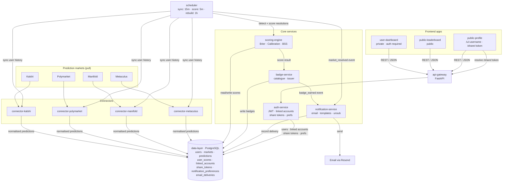

# Architecture

## What Tiresias is

Tiresias is a reputation layer for prediction markets. A user connects one or more
market accounts (Kalshi, Polymarket, Manifold, Metaculus). A background scheduler pulls
their prediction history from each platform, normalises it, and stores it in a shared
Postgres database. When markets resolve, a scoring engine computes Brier scores,
calibration, and Brier Skill Score; a badge service evaluates milestone / quality
badges; a notification service emails the user when things change. Three SvelteKit
frontends surface all of this: a private dashboard for the forecaster, a public
leaderboard, and shareable public profile pages.

## Tech stack

| Layer | Choice | Notes |
|---|---|---|
| Language (backend) | Python 3.12+ | Uses `enum.StrEnum` natively; 3.10 polyfill exists only for test collection. |
| Web framework | FastAPI + Uvicorn | Async throughout. |
| Database | PostgreSQL 16 | Single logical DB; one schema. |
| DB driver / ORM | asyncpg + SQLAlchemy 2.0 (async) | Every CRUD helper returns awaitables. |
| Migrations | Alembic | Versions 0001–0004 live under `services/data-layer/alembic/versions/`. |
| Background jobs | APScheduler (AsyncIO) | Single in-process scheduler with three recurring jobs. |
| Auth | PyJWT + bcrypt (via passlib) | HMAC-signed access tokens; bcrypt-hashed passwords. |
| Secret storage | Fernet (cryptography) | Platform credentials encrypted at rest with a single server-side key. |
| HTTP client | httpx (async) | All connectors. |
| Validation | Pydantic v2 | Request/response schemas for the API. |
| Email delivery | Resend + Jinja2 templates | Notifications service. Handlers are currently stubs. |
| Frontend | SvelteKit 2 + Vite | Three separate apps. |
| Frontend language | TypeScript | `svelte-check` for type-checking. |
| Container runtime | Podman or Docker | One `Containerfile` per service. |

## Repository layout

```
tiresias/
├── services/                          # Python backend services
│   ├── data-layer/                   # SQLAlchemy models + Alembic migrations
│   ├── api-gateway/                  # FastAPI app, mounts service routers
│   ├── auth-service/                 # Registration, JWT, linked accounts, share tokens, notification prefs
│   ├── scheduler/                    # APScheduler runner + job definitions
│   ├── scoring-engine/               # Brier, calibration, Brier Skill Score
│   ├── badge-service/                # Badge catalogue + issuance/revocation
│   ├── notification-service/         # Email dispatcher + Jinja2 templates + RFC 8058 unsubscribe
│   ├── connector-kalshi/             # Kalshi CLOB client (RSA-PSS signed)
│   ├── connector-polymarket/         # Gamma + Data APIs (public)
│   ├── connector-manifold/           # Manifold REST (Bearer token)
│   └── connector-metaculus/          # Metaculus REST (Token auth, auto-paginating)
│
├── apps/                              # SvelteKit frontends
│   ├── user-dashboard/               # Private, auth-required: history, stats, settings
│   ├── public-leaderboard/           # Public: rankings
│   └── public-profile/               # Public: /u/:username and /share/:token
│
├── tests/                             # Cross-service tests
│   ├── integration/                  # Requires a running DB
│   └── e2e/                          # Requires the whole stack
│
├── research/                          # Snapshots of each platform's API docs (reference only)
│   ├── kalshi/    polymarket/    manifold/    metaculus/
│
├── scripts/                           # Operator utilities
│   ├── cred.py                       # Fernet encrypt/decrypt/genkey for stored credentials
│   └── test_metaculus_live.py        # End-to-end smoke test for Metaculus sync
│
├── data/postgres/                    # Bind-mounted Postgres data (gitignored)
├── compose.yaml                      # Local dev stack (db + migrate)
├── install-deps.sh                   # pip install for every service
├── conftest.py                       # Adds every service to sys.path for pytest
├── pytest.ini                        # asyncio_mode=auto, importlib mode
├── .env.example                      # Env var template with inline docs
├── .gitleaks.toml                    # Secret-scanning rules
└── docs/                              # You are here
```

Every service follows the same internal shape:

```
services/<service-name>/
├── <service_name>/        # The actual Python package (underscores, not dashes)
│   ├── __init__.py
│   └── ...                # Service-specific modules
├── tests/
├── requirements.txt
└── Containerfile
```

Connectors go a level deeper with a consistent trio:

```
services/connector-<platform>/connector_<platform>/
├── client.py      # HTTP client; knows auth scheme and endpoints
├── adapter.py     # Normalises raw API responses into the internal Market / Prediction shape
└── sync.py        # Orchestrates client + adapter + CRUD upserts
```

## System diagram



Key data-flow notes not captured visually:

- The scheduler imports every other service as a Python package and calls them in-process.
  There are no internal HTTP hops between scheduler, scoring engine, badge service, and
  notification service — the arrows in the diagram represent logical data flow, not
  network traffic.
- The API gateway currently only mounts the auth-service router. As badge, user, and
  leaderboard routers are implemented, they will mount here too (`services/api-gateway/api_gateway/app.py`).
- Social publishing (X / Bluesky) is in the README's architecture story but is
  intentionally out of scope for v1 — see [FUTURE_FEATURES.md](../FUTURE_FEATURES.md).
- Notification-service handlers are stubs today; the scheduler dispatches events and
  silently swallows `NotImplementedError` so sync and scoring continue to work.

## Background job cadence

```
every  5 min   detect_and_score_resolutions
                 └─ finds markets resolved since last run
                 └─ scores affected users
                 └─ diffs badges against previous state
                 └─ dispatches notifications for new badges / resolutions

every 15 min   sync_all_markets
                 └─ for each active user with linked accounts:
                      decrypt credentials
                      call the right connector's sync.py
                      upsert markets + predictions

every  1 hour  rebuild_leaderboard
                 └─ full recompute of user_scores from raw predictions
                 └─ corrects drift from the incremental scoring path
```

## Database

Four migrations in order:

1. `0001_initial_schema` — `users`, `markets`, `predictions`, `user_scores`.
2. `0002_user_settings` — profile fields (`display_name`, `bio`, `avatar_url`),
   `linked_accounts`, `share_tokens`, `notification_preferences`.
3. `0003_sync_external_ids` — adds `source` / `external_id` to `markets` and
   `predictions`, adds `badge_ids JSONB` to `user_scores`, partial unique indexes for
   idempotent sync upserts.
4. `0004_email_deliveries` — dedupe table for outbound notification emails.

Invariants worth knowing:

- **One prediction per `(user_id, market_id)`.** Manually-entered predictions are never
  overwritten by a sync; the scheduler uses upsert-on-insert, last-write-wins semantics
  per source.
- **External predictions use the most recent bet's probability.** If a user changes their
  mind on a Manifold market, only the last bet is stored.
- **Badges live on `user_scores.badge_ids` as JSONB.** No separate badges table in v1.

## Badges

Defined in `services/badge-service/badge_service/badges.py`. The current catalogue:

| ID | Name | Criterion |
|---|---|---|
| `first-prediction` | First Prediction | ≥ 1 resolved prediction |
| `ten-predictions` | Getting Started | ≥ 10 resolved predictions |
| `hundred-predictions` | Prolific Forecaster | ≥ 100 resolved predictions |
| `above-baseline` | Better Than Coin Flip | Brier Skill Score > 0 |
| `well-calibrated` | Well Calibrated | ECE < 0.05 with ≥ 50 predictions |
| `multi-platform` | Cross-Platform Forecaster | Resolved predictions on ≥ 3 platforms |

Adding a badge is a single entry in `BADGES` plus a predicate over `UserScoreResult`.

## External integrations

| Platform | Auth | Rate limit | Connector notes |
|---|---|---|---|
| Kalshi | RSA-PSS signed requests using a per-account `.key` file. | Basic tier = 20 reads/sec. | `KalshiClient` signs headers; v1 uses a single env-var key for all users. Per-user keys are planned. |
| Polymarket | None for Gamma + Data APIs. | None published for public APIs. | Wallet address alone is enough to fetch positions and trades. |
| Manifold | `Authorization: Key <token>` | Generous. | Binary markets only in v1. Multi-choice has a known bug — see MEMORY.md. |
| Metaculus | `Authorization: Token <token>` (optional) | Much higher with token. | Connector auto-paginates via `next` links; binary markets only. |

Raw snapshots of each platform's API documentation live under `research/<platform>/` for
offline reference.
